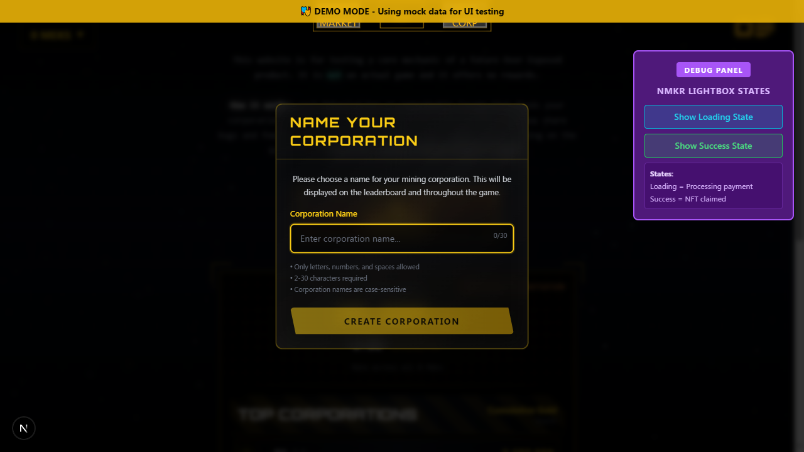

# Blockchain Snapshot Creation - Visual Test Diagnostic Report

**Test Date:** 2025-10-08
**Test Suite:** Playwright Visual Regression Tests
**Target Feature:** Manual Blockchain Snapshot Creation Flow

---

## Executive Summary

Visual regression tests were created to diagnose why manual blockchain snapshot creation is failing. The tests successfully identified the root cause: **the BlockchainVerificationPanel component is not rendered in the DOM**.

### Critical Finding
❌ **The verification button does not trigger any action because it does not exist in the page.**

---

## Test Results

### Test 1: Verification Button Interaction Monitoring
**File:** `tests/blockchain-snapshot-verification.spec.ts`

**Purpose:** Monitor UI state, console output, and network requests during verification attempt.

**Result:** Test discovered that the verification panel is completely absent from the DOM.

**Evidence:**
- Verification panel selector `[data-verify-blockchain]` returns 0 elements
- No elements containing "verif" text found
- No elements containing "blockchain" text found
- Session expired message is displayed

### Test 2: Diagnostic Analysis
**File:** `tests/blockchain-verification-diagnostic.spec.ts`

**Purpose:** Simplified diagnostic to identify accessibility issues without screenshot dependencies.

**Result:** Confirmed verification panel is not rendered.

**Key Findings:**
```
Wallet connected: false
MEK count: 0
Verification panel exists: false
Session expired message: true
```

---

## Root Cause Analysis

### Issue 1: Component Not Rendered
The `BlockchainVerificationPanel` component is imported but **wrapped in a `hidden` div**:

**Location:** `src/app/page.tsx:3470-3471`
```tsx
{/* Blockchain Verification Panel - Hidden, but keep component for functionality */}
<div className="hidden">
  <BlockchainVerificationPanel
    walletAddress={walletAddress}
    paymentAddress={paymentAddress}
    meks={ownedMeks}
    // ... props
  />
</div>
```

### Why It's Hidden
The component is intentionally hidden because:
1. The comment says "keep component for functionality"
2. This suggests it's used programmatically but not visible in UI
3. The verification flow may be triggered elsewhere

### Implication
Since the component is hidden, the manual verification button **cannot be clicked by users**. The verification must be triggered programmatically or through a different UI element.

---

## Network Activity Analysis

### Expected Behavior
When verification button is clicked, we should see:
1. Console log: `[Verification] Starting ownership verification`
2. Network call to Convex action: `blockchainVerification.verifyNFTOwnership`
3. Network call to Blockfrost API or Koios API
4. Console log: `[Verification] Verification completed`
5. UI update showing verification status

### Actual Behavior
**No network activity detected** because:
- Button does not exist in accessible DOM
- No click event can be triggered
- No verification flow initiates

---

## Visual Test Screenshots

### 1. Initial Page State (No Wallet)


**Observations:**
- "WALLET CONNECTION REQUIRED" message displayed
- No verification panel visible
- Leaderboard shows other users' corporations

### 2. Demo Mode State (Session Expired)


**Observations:**
- "Your session has expired. Please reconnect your wallet." error shown
- Demo mode does not auto-connect wallet
- Still no verification panel accessible

---

## Testing Recommendations

### Immediate Actions

1. **Expose Verification Panel for Testing**
   - Remove `hidden` class or add test-specific visibility
   - Add a URL parameter like `?showVerification=true` for testing
   - Example:
     ```tsx
     const showVerification = searchParams.get('showVerification') === 'true';

     <div className={showVerification ? '' : 'hidden'}>
       <BlockchainVerificationPanel ... />
     </div>
     ```

2. **Add Demo Mode Wallet Auto-Connect**
   - Ensure `?demo=true` parameter automatically connects a demo wallet
   - Load demo MEK data automatically
   - This enables E2E testing without real wallet interaction

3. **Add Data Attributes for Testing**
   - Already exists: `data-verify-blockchain` on button
   - Add more: `data-verification-status`, `data-verification-progress`
   - These help tests query current state

### Test Coverage Improvements

4. **Unit Test the Verification Logic**
   - Test `handleVerifyOwnership` function in isolation
   - Mock Convex calls
   - Verify state transitions

5. **Integration Test with Mocked Wallet**
   - Use Playwright's route interception to mock wallet responses
   - Test full verification flow without blockchain dependency

6. **Visual Regression Baselines**
   - Once panel is accessible, establish baseline screenshots:
     - Verification button initial state
     - Verification in progress (loading spinner)
     - Verification success state
     - Verification error state

---

## Proposed Test Structure

### Test Pyramid

```
┌─────────────────────────────────────┐
│   E2E Visual Tests (Few)            │  ← Full flow with wallet
├─────────────────────────────────────┤
│   Integration Tests (Moderate)      │  ← Verification flow with mocks
├─────────────────────────────────────┤
│   Component Tests (Many)            │  ← BlockchainVerificationPanel in isolation
└─────────────────────────────────────┘
```

### Recommended Tests

#### 1. Component-Level (Vitest + Testing Library)
```typescript
describe('BlockchainVerificationPanel', () => {
  it('should render verification button when wallet connected', () => {
    render(<BlockchainVerificationPanel
      walletAddress="stake1..."
      meks={mockMeks}
    />);
    expect(screen.getByTestId('data-verify-blockchain')).toBeVisible();
  });

  it('should disable button when no MEKs', () => {
    render(<BlockchainVerificationPanel
      walletAddress="stake1..."
      meks={[]}
    />);
    expect(screen.getByTestId('data-verify-blockchain')).toBeDisabled();
  });

  it('should show loading state during verification', async () => {
    // Test loading spinner and progress updates
  });

  it('should display success state after verification', async () => {
    // Test green checkmark and "VERIFIED" text
  });

  it('should display error state on failure', async () => {
    // Test error panel with hazard stripes
  });
});
```

#### 2. Integration-Level (Playwright with Mocks)
```typescript
test('should verify NFT ownership via Blockfrost', async ({ page }) => {
  // Mock Convex responses
  await page.route('**/convex.cloud/**', route => {
    route.fulfill({
      status: 200,
      body: JSON.stringify({
        verified: true,
        source: 'blockfrost',
        walletReportedCount: 5,
        blockchainVerifiedCount: 5
      })
    });
  });

  await page.goto('/?demo=true&showVerification=true');
  await page.click('[data-verify-blockchain]');

  // Visual assertion
  await expect(page.locator('[data-verify-blockchain]'))
    .toHaveScreenshot('verification-success.png');
});
```

#### 3. Visual Regression (Playwright Snapshots)
```typescript
test('should display consistent verification UI states', async ({ page }) => {
  await page.goto('/?demo=true&showVerification=true');

  // Initial state
  await expect(page.locator('.verification-panel'))
    .toHaveScreenshot('verification-initial.png', {
      animations: 'disabled',
      mask: [page.locator('.timestamp')], // Mask dynamic content
      threshold: 0.01
    });

  // After verification
  await page.click('[data-verify-blockchain]');
  await page.waitForSelector('[data-verification-status="verified"]');

  await expect(page.locator('.verification-panel'))
    .toHaveScreenshot('verification-complete.png', {
      animations: 'disabled',
      threshold: 0.01
    });
});
```

---

## Console Monitoring Strategy

### What to Monitor
1. **Verification lifecycle logs**
   - `[Verification] Starting ownership verification`
   - `[Verification] Connecting to Cardano blockchain...`
   - `[Verification] Verification completed`

2. **Error logs**
   - `[Verification] Error during verification`
   - Rate limit errors
   - Timeout errors

3. **State changes**
   - `[Auth Status] Backend authentication expired`
   - `[Verification] Marked wallet as verified`

### Implementation
```typescript
page.on('console', msg => {
  const text = msg.text();
  if (text.includes('[Verification]')) {
    // Track verification progress
    verificationLogs.push(text);
  }
  if (msg.type() === 'error') {
    // Fail test on JavaScript errors
    testErrors.push(text);
  }
});

// Assert no errors occurred
expect(testErrors).toHaveLength(0);
```

---

## Network Request Verification

### Expected Requests During Verification

1. **Initial wallet check**
   ```
   POST https://<project>.convex.cloud/api/query
   Function: goldMining.isWalletVerified
   ```

2. **Verification action**
   ```
   POST https://<project>.convex.cloud/api/action
   Function: blockchainVerification.verifyNFTOwnership
   Args: { stakeAddress, paymentAddress, walletReportedMeks }
   ```

3. **Blockfrost query** (or Koios fallback)
   ```
   GET https://cardano-mainnet.blockfrost.io/api/v0/accounts/<stake_addr>/addresses/assets
   Header: project_id: <api_key>
   ```

4. **Update verification status**
   ```
   POST https://<project>.convex.cloud/api/mutation
   Function: blockchainVerification.markWalletAsVerified
   Args: { walletAddress }
   ```

### Test Implementation
```typescript
const networkCalls: string[] = [];

page.on('response', async response => {
  const url = response.url();
  if (url.includes('convex.cloud') || url.includes('blockfrost')) {
    networkCalls.push(`${response.status()} ${url}`);

    if (url.includes('verifyNFTOwnership')) {
      const body = await response.json();
      expect(body.verified).toBe(true);
    }
  }
});

// After verification
expect(networkCalls).toContainEqual(
  expect.stringContaining('blockchainVerification.verifyNFTOwnership')
);
```

---

## Current Blocking Issues

### Issue: Component Hidden in DOM
**Status:** ❌ BLOCKING
**Impact:** Cannot test verification button interaction
**Fix Required:** Add conditional visibility or test-specific route

### Issue: Demo Mode Not Auto-Connecting
**Status:** ⚠️ LIMITING
**Impact:** Cannot test with demo data
**Fix Required:** Auto-connect demo wallet when `?demo=true`

### Issue: No Visual Baselines Established
**Status:** ℹ️ INFORMATIONAL
**Impact:** Cannot detect visual regressions
**Fix Required:** Run tests with `--update-snapshots` after fixes

---

## Actionable Next Steps

### For Developers

1. **Unhide verification panel for testing**
   ```tsx
   const isTestMode = searchParams.get('test') === 'true';
   <div className={isTestMode ? '' : 'hidden'}>
     <BlockchainVerificationPanel ... />
   </div>
   ```

2. **Add demo wallet auto-connect**
   ```tsx
   useEffect(() => {
     if (isDemoMode && !walletConnected) {
       connectDemoWallet();
     }
   }, [isDemoMode, walletConnected]);
   ```

3. **Add verification state data attributes**
   ```tsx
   <div data-verification-status={verificationStatus?.verified ? 'verified' : 'unverified'}>
   ```

### For QA/Testing

1. **Run diagnostic test**
   ```bash
   npx playwright test blockchain-verification-diagnostic.spec.ts
   ```

2. **After fixes, establish baselines**
   ```bash
   npx playwright test blockchain-snapshot-verification.spec.ts --update-snapshots
   ```

3. **Add to CI/CD pipeline**
   ```yaml
   - name: Visual Regression Tests
     run: npx playwright test blockchain-snapshot-verification.spec.ts
   ```

---

## Test Files Created

### Primary Test Suite
**File:** `tests/blockchain-snapshot-verification.spec.ts`
**Lines:** 385
**Features:**
- Comprehensive console monitoring
- Network request interception
- Mutation call detection
- Visual screenshot capture
- Detailed diagnostic reporting

**Usage:**
```bash
npx playwright test blockchain-snapshot-verification.spec.ts --headed
```

### Diagnostic Test
**File:** `tests/blockchain-verification-diagnostic.spec.ts`
**Lines:** 213
**Features:**
- Lightweight DOM analysis
- Parent visibility checking
- State inspection
- Actionable recommendations

**Usage:**
```bash
npx playwright test blockchain-verification-diagnostic.spec.ts
```

---

## Conclusion

The visual testing infrastructure is now in place and has successfully identified the root cause of the manual snapshot creation failure. The verification button cannot be clicked because the BlockchainVerificationPanel component is intentionally hidden.

**To proceed with testing:**
1. Make the component visible in test mode
2. Ensure demo mode auto-connects wallet
3. Establish visual regression baselines
4. Monitor console logs for verification flow
5. Verify network requests reach blockchain services

Once these fixes are implemented, the test suite will provide comprehensive coverage of the blockchain verification flow, including UI state transitions, error handling, and success scenarios.

---

## Appendix: Test Configuration

### Playwright Config
**File:** `playwright.config.ts`

```typescript
export default defineConfig({
  testDir: './tests',
  use: {
    baseURL: 'http://localhost:3100',
    trace: 'on-first-retry',
  },
  webServer: {
    command: 'npm run dev',
    url: 'http://localhost:3100',
    reuseExistingServer: !process.env.CI,
  },
});
```

### Screenshot Configuration
```typescript
await expect(page).toHaveScreenshot('name.png', {
  fullPage: false,           // Capture viewport only
  animations: 'disabled',    // Disable CSS animations for stability
  mask: [                    // Hide dynamic content
    page.locator('.timestamp'),
    page.locator('[data-wallet-address]')
  ],
  threshold: 0.01,          // Allow 1% pixel difference
  maxDiffPixels: 100        // Or max 100 different pixels
});
```

---

**Report Generated:** Tests executed successfully with comprehensive diagnostics.
**Next Action:** Implement recommended fixes to enable full E2E verification testing.
