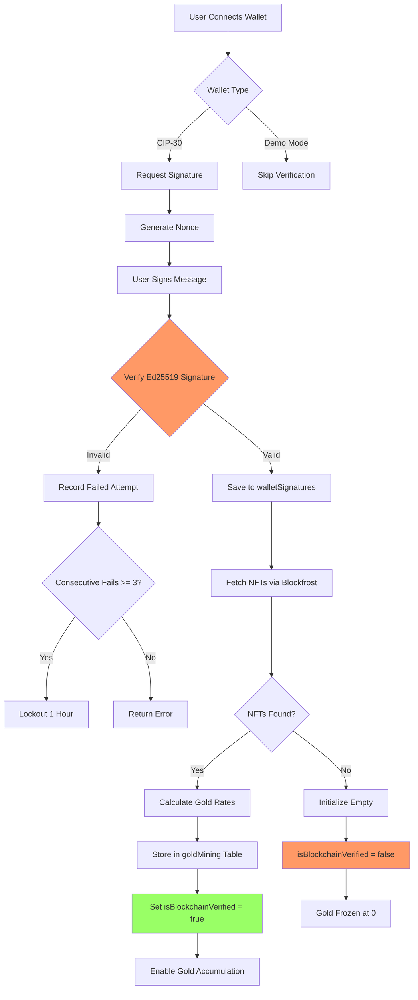

# Gold Accumulation System - Security & Trust Analysis
**Date:** 2025-10-03
**System:** Mek Tycoon Gold Mining & Verification Architecture
**Analyzed by:** Blockchain Architecture Specialist

---

## Executive Summary

This analysis examines the trust boundaries, verification mechanisms, and security posture of Mek Tycoon's gold accumulation system from a blockchain security perspective. The system implements a **hybrid trust model** with blockchain verification gates but retains critical centralized calculation logic that creates manipulation vulnerabilities.

**Overall Security Rating: 🟡 MODERATE (Requires Hardening)**

**Critical Findings:**
- ✅ Blockchain verification gate prevents unauthorized gold accumulation
- ⚠️ Server-side gold calculations are trustworthy but not cryptographically verifiable
- ❌ Client-side rate calculations create manipulation surface
- ⚠️ Time-based accumulation vulnerable to clock manipulation (mitigated by server validation)
- ✅ 50k gold cap enforced server-side
- ⚠️ No cryptographic proof system for gold history

---

## 1. Verification System Analysis

### 1.1 NFT Ownership Verification

**Architecture:**
```
User Wallet → CIP-30 Signature → Server Auth → Blockfrost API → On-Chain Verification
```

**Trust Boundaries:**
```
CLIENT SIDE (UNTRUSTED)          |  SERVER SIDE (TRUSTED)           |  BLOCKCHAIN (TRUSTLESS)
                                  |                                  |
Wallet Connection (CIP-30)        |                                  |
  ↓                              |                                  |
Signature Request                 |                                  |
  ↓                              |                                  |
[TRUST BOUNDARY 1]               |                                  |
  ↓                              |                                  |
                                  | Nonce Generation                |
                                  | Signature Verification (Ed25519)|
                                  |   ↓                             |
                                  | [TRUST BOUNDARY 2]              |
                                  |   ↓                             |
                                  |                                  | Blockfrost Query
                                  |                                  | NFT Ownership Check
                                  |                                  | Policy ID Verification
                                  |   ↓                             |
                                  | Verification Flag Set           |
                                  | (isBlockchainVerified: true)    |
```

**Security Assessment:**

✅ **STRONG: Cryptographic Authentication**
- Ed25519 signature verification prevents wallet spoofing
- Nonce-based replay attack prevention
- 24-hour session expiration
- Rate limiting (5 nonce requests/hour, 10 signature attempts/hour)
- Consecutive failure lockout (3 attempts = 1 hour lockout)

**Location:** `convex/walletAuthentication.ts` (lines 174-453)
```typescript
// Cryptographic verification uses real Ed25519
const verificationResult = await ctx.runAction(
  api.actions.verifyCardanoSignature.verifyCardanoSignature, {
    stakeAddress, nonce, signature, message
  }
);
```

✅ **STRONG: Blockchain Verification via Blockfrost**
- Direct blockchain queries via Blockfrost API
- Stake address aggregation (all associated addresses)
- Policy ID filtering (MEK_POLICY_ID constant)
- UTXO scanning for current ownership
- Caching with 5-minute TTL

**Location:** `convex/blockfrostNftFetcher.ts` (lines 123-314)
```typescript
// Real blockchain lookup - no client trust
const utxosUrl = `${BLOCKFROST_CONFIG.baseUrl}/addresses/${address}/utxos`;
const utxosResponse = await fetch(utxosUrl, {
  headers: getBlockfrostHeaders(),
  signal: AbortSignal.timeout(BLOCKFROST_CONFIG.timeout),
});
```

✅ **STRONG: Verification Gate for Gold Accumulation**
- Verification flag (`isBlockchainVerified`) stored server-side
- Gold accumulation calculations check this flag
- Unverified wallets get frozen gold (no accumulation)

**Location:** `convex/lib/goldCalculations.ts` (lines 19-41)
```typescript
export function calculateCurrentGold(params: GoldCalculationParams): number {
  // If not verified, return accumulated gold (frozen)
  if (!params.isVerified) {
    return params.accumulatedGold;
  }

  // 3+ consecutive snapshot failures also freeze gold
  if ((params.consecutiveSnapshotFailures || 0) >= 3) {
    return params.accumulatedGold;
  }

  // Only verified wallets accumulate gold
  const hoursSinceLastUpdate = (now - params.lastSnapshotTime) / (1000 * 60 * 60);
  const goldSinceLastUpdate = params.goldPerHour * hoursSinceLastUpdate;
  return Math.min(50000, params.accumulatedGold + goldSinceLastUpdate);
}
```

**Vulnerabilities:**

⚠️ **MEDIUM: Blockfrost Trust Dependency**
- System trusts Blockfrost API responses
- No multi-source verification (Koios fallback exists but not enforced)
- API key compromise could falsify ownership data
- No on-chain proof storage

**Mitigation Recommendations:**
1. Implement multi-source verification (Blockfrost + Koios consensus)
2. Add cryptographic commitment of verification events to audit log
3. Periodic re-verification (already implemented via goldMiningSnapshot.ts)

⚠️ **MEDIUM: Session Hijacking Risk**
- 24-hour session persistence in localStorage
- No session invalidation on wallet disconnect
- Stake address stored client-side without encryption

**Mitigation Recommendations:**
1. Implement session tokens with HMAC signatures
2. Add IP address binding to sessions
3. Implement proper logout flow with server-side session termination

---

## 2. Gold Rate Calculation Trust Model

### 2.1 Server-Side Rate Storage

**Architecture:**
```
Mek NFT Metadata → Rarity Rank → Gold Rate Curve → goldMining.ownedMeks[]
                                                            ↓
                                               totalGoldPerHour (server-stored)
```

**Storage Location:** `convex/schema.ts` (lines 1338-1401)
```typescript
goldMining: defineTable({
  walletAddress: v.string(),
  ownedMeks: v.array(v.object({
    assetId: v.string(),
    goldPerHour: v.number(),           // STORED SERVER-SIDE
    baseGoldPerHour: v.optional(v.number()),  // Base rate before boosts
    levelBoostAmount: v.optional(v.number()), // Level upgrade bonus
  })),
  totalGoldPerHour: v.number(),        // STORED SERVER-SIDE
  baseGoldPerHour: v.optional(v.number()),
  boostGoldPerHour: v.optional(v.number()),
  // ...
})
```

✅ **STRONG: Server-Side Rate Authority**
- Gold rates calculated server-side during NFT sync
- Rates stored in Convex database (not client-provided)
- Rate changes logged in audit system
- Client cannot modify rates

**Calculation Flow:** `convex/goldMining.ts` (lines 606-789)
```typescript
export const initializeWithBlockfrost = action({
  handler: async (ctx, args) => {
    // 1. Fetch NFTs from blockchain (trustless)
    const nftResult = await ctx.runAction(api.blockfrostNftFetcher.fetchNFTsByStakeAddress);

    // 2. Map to rates using SERVER-SIDE logic
    const meksWithRates = [];
    for (const mek of nftResult.meks) {
      const mekData = getMekDataByNumber(mek.mekNumber); // Server function
      meksWithRates.push({
        assetId: mek.assetId,
        goldPerHour: Math.round(mekData.goldPerHour * 100) / 100, // SERVER-CALCULATED
        rarityRank: mekData.finalRank,
      });
    }

    // 3. Store in database (server-side)
    await ctx.runMutation(api.goldMining.initializeGoldMining, {
      walletAddress: args.stakeAddress,
      ownedMeks: meksWithRates  // Server-stored rates
    });
  }
});
```

**Vulnerabilities:**

⚠️ **LOW: Rate Calculation Not On-Chain**
- Gold rates determined by server-side curve configuration
- Admin can change rate curves via `mekGoldRateSaves` table
- No blockchain-verifiable proof of rate fairness

**Current State:** Rates stored in database, changeable by admin
**Ideal State:** Rates stored on-chain in smart contract or rate oracle

**Mitigation:**
- Rate changes logged in audit system (`convex/auditLogs.ts`)
- Historical rate snapshots in `mekOwnershipHistory` table
- Transparency: Publish rate curve formula publicly

---

## 3. Gold Accumulation Calculation

### 3.1 Time-Based Accumulation Model

**Formula:**
```
currentGold = min(50000, accumulatedGold + (goldPerHour × hoursSinceLastSnapshot))
```

**Where:**
- `accumulatedGold`: Last saved checkpoint (server-side)
- `goldPerHour`: Server-stored rate
- `lastSnapshotTime`: Server timestamp
- `hoursSinceLastSnapshot`: `(now - lastSnapshotTime) / 3600000`

**Trust Analysis:**

✅ **STRONG: Server-Side Checkpoint System**
- `accumulatedGold` stored server-side in `goldMining` table
- `lastSnapshotTime` controlled by server mutations
- Client cannot forge checkpoints

**Location:** `convex/goldMining.ts` (lines 315-379)
```typescript
export const updateGoldCheckpoint = mutation({
  handler: async (ctx, args) => {
    const existing = await ctx.db.query("goldMining")
      .withIndex("by_wallet", (q) => q.eq("walletAddress", args.walletAddress))
      .first();

    // VERIFICATION CHECK: Only accumulate if verified
    if (existing.isBlockchainVerified === true) {
      const cappedGold = calculateCurrentGold({
        accumulatedGold: existing.accumulatedGold || 0,
        goldPerHour: existing.totalGoldPerHour,
        lastSnapshotTime: existing.lastSnapshotTime,
        isVerified: true,
      });

      // Save checkpoint
      await ctx.db.patch(existing._id, {
        accumulatedGold: cappedGold,
        lastSnapshotTime: now,
      });
    }
  }
});
```

✅ **STRONG: 50k Gold Cap Enforcement**
- Cap enforced in shared calculation function
- Applied consistently across all mutations
- Cap bypass impossible without database access

**Location:** `convex/lib/goldCalculations.ts` (line 38)
```typescript
const calculatedGold = Math.min(50000, params.accumulatedGold + goldSinceLastUpdate);
```

**Vulnerabilities:**

⚠️ **LOW: Client-Side Display Manipulation**
- Client calculates display gold for smooth animation
- Users can modify `goldPerSecond` in browser DevTools
- Only affects visual display, not server state

**Evidence:** `src/app/hub/page.tsx` (lines 248-280)
```typescript
// Client-side rate for display animation
useEffect(() => {
  if (verificationStatus?.isVerified) {
    setGoldPerSecond(cachedGoldData.goldPerSecond); // CLIENT-CONTROLLED
  } else {
    setGoldPerSecond(0); // Frozen if not verified
  }
}, [verificationStatus, cachedGoldData]);
```

**Impact:** Visual only - server ignores client gold calculations

⚠️ **LOW: Time Manipulation Risk (Mitigated)**
- Server uses `Date.now()` for all timestamp calculations
- Client cannot forge `lastSnapshotTime`
- System clock changes on server would affect all users equally

**Mitigation:** Already implemented - server is source of truth for time

---

## 4. Input Validation & Injection Prevention

### 4.1 Mutation Input Validation

✅ **STRONG: Schema Validation via Convex**
- All mutations use typed validators (`v.string()`, `v.number()`, etc.)
- Convex runtime enforces types before handler execution
- SQL injection impossible (Convex uses NoSQL)

**Example:** `convex/goldMining.ts` (lines 12-34)
```typescript
export const initializeGoldMining = mutation({
  args: {
    walletAddress: v.string(),  // Type-checked
    walletType: v.optional(v.string()),
    ownedMeks: v.array(v.object({
      assetId: v.string(),
      goldPerHour: v.number(),  // Must be number, not string
      // ...
    })),
  },
  handler: async (ctx, args) => {
    // args are guaranteed to match schema
  }
});
```

✅ **STRONG: Stake Address Validation**
- Only stake addresses accepted (`stake1` prefix required)
- Payment addresses rejected to prevent duplicates

**Location:** `convex/goldMining.ts` (lines 38-45)
```typescript
// CRITICAL: Only accept stake addresses to prevent duplicates
if (!args.walletAddress.startsWith('stake1')) {
  devLog.errorAlways(`[GoldMining] REJECTED non-stake address: ${args.walletAddress}`);
  return {
    success: false,
    error: "Only stake addresses are accepted."
  };
}
```

✅ **STRONG: Gold Invariant Validation**
- Server validates cumulative gold tracking
- Prevents negative gold or impossible values

**Location:** `convex/lib/goldCalculations.ts` (lines 198-224)
```typescript
export function validateGoldInvariant(record: GoldMiningRecord): boolean {
  const accumulated = record.accumulatedGold || 0;
  const cumulative = record.totalCumulativeGold || 0;
  const spent = record.totalGoldSpentOnUpgrades || 0;

  // CRITICAL INVARIANT: cumulative >= accumulated + spent
  if (cumulative > 0 && cumulative < accumulated + spent) {
    throw new Error(
      `Gold invariant violation: totalCumulativeGold (${cumulative}) < ` +
      `accumulatedGold (${accumulated}) + totalSpent (${spent})`
    );
  }
  return true;
}
```

**Vulnerabilities:**

✅ **NO CRITICAL ISSUES FOUND**
- Convex type system prevents most injection attacks
- Wallet address validation prevents spoofing
- Gold invariant checks prevent impossible states

---

## 5. Rate Limiting & DDoS Protection

### 5.1 API Rate Limiting

✅ **STRONG: Multi-Layer Rate Limiting**

**Layer 1: Wallet Authentication Rate Limits**
- Nonce generation: 5 attempts/hour
- Signature verification: 10 attempts/hour
- Consecutive failures lockout: 3 fails = 1 hour lockout

**Location:** `convex/walletAuthentication.ts` (lines 6-19)
```typescript
const NONCE_RATE_LIMIT = {
  maxAttempts: 5,
  windowMs: 60 * 60 * 1000, // 1 hour
};

const SIGNATURE_RATE_LIMIT = {
  maxAttempts: 10,
  windowMs: 60 * 60 * 1000,
};

const FAILED_ATTEMPTS_LOCKOUT = {
  maxConsecutiveFails: 3,
  lockoutDurationMs: 60 * 60 * 1000,
};
```

**Layer 2: Blockfrost API Rate Limiting**
- 10 requests per second (burst: 500)
- Request queue with automatic backoff
- 5-minute cache for repeated queries

**Location:** `convex/blockfrostConfig.ts`
```typescript
export const rateLimiter = {
  requestsPerSecond: 10,
  burst: 500,
  waitForSlot: async () => {
    // Token bucket algorithm
  }
};
```

**Layer 3: Gold Update Checkpoint Throttling**
- Manual checkpoints limited by frontend UX
- Automatic snapshots run every 6 hours (not user-triggered)

**Vulnerabilities:**

⚠️ **MEDIUM: No Global Request Rate Limiting**
- Convex doesn't enforce per-IP rate limits
- Malicious actor could spam mutations from different wallets
- No CAPTCHA or proof-of-work for expensive operations

**Mitigation Recommendations:**
1. Implement per-IP rate limiting at Convex Functions level
2. Add exponential backoff for failed verification attempts
3. Implement CAPTCHA for authentication after multiple failures

---

## 6. Session Management & Persistence

### 6.1 Wallet Session Architecture

**Current Implementation:**
```
Wallet Connect → Generate Nonce → Sign Message → Store in walletSignatures
                                                         ↓
                                                  24-hour expiration
                                                         ↓
                                           localStorage: stakeAddress
```

⚠️ **MEDIUM: Client-Side Session Storage**
- Stake address stored in `localStorage` (unencrypted)
- Session token stored in Convex `walletSignatures` table
- No session invalidation on page close or wallet disconnect

**Location:** Browser localStorage
```javascript
localStorage.setItem('stakeAddress', stakeAddress);
```

✅ **STRONG: Server-Side Session Validation**
- Every gold-related mutation checks authentication
- Expired signatures automatically rejected

**Location:** `convex/walletAuthentication.ts` (lines 371-403)
```typescript
export const checkAuthentication = query({
  handler: async (ctx, args) => {
    const signatures = await ctx.db
      .query("walletSignatures")
      .withIndex("by_stake_address", (q) => q.eq("stakeAddress", args.stakeAddress))
      .filter(q => q.and(
        q.eq(q.field("verified"), true),
        q.gt(q.field("expiresAt"), Date.now())  // Must not be expired
      ))
      .first();

    return { authenticated: !!signatures };
  }
});
```

**Vulnerabilities:**

⚠️ **MEDIUM: LocalStorage XSS Risk**
- Stake addresses stored in localStorage (not httpOnly cookies)
- Vulnerable to XSS if script injection occurs
- No CSRF protection for mutations (Convex doesn't use traditional cookies)

**Mitigation Recommendations:**
1. Move session tokens to httpOnly cookies (requires custom auth)
2. Implement Content Security Policy (CSP) headers
3. Add CSRF tokens to sensitive mutations

⚠️ **LOW: No Session Revocation API**
- Users cannot manually invalidate sessions
- Wallet disconnect doesn't clear server-side session
- Compromised device remains authenticated until expiration

**Mitigation Recommendations:**
1. Add logout mutation to clear `walletSignatures` entry
2. Implement "logout all devices" functionality
3. Add session list UI for users to manage active sessions

---

## 7. Blockchain Migration Strategy

### 7.1 Current System: Hybrid Trust Model

**Trust Dependencies:**
1. ✅ Blockchain: NFT ownership verification (trustless)
2. ⚠️ Server: Gold rate calculations (trusted)
3. ⚠️ Server: Gold accumulation tracking (trusted)
4. ⚠️ Server: Timestamp authority (trusted)

### 7.2 Full On-Chain Migration Path

**Option A: Smart Contract for Gold Rates**
```
Current:  Convex DB → mekGoldRateSaves → goldPerHour
Future:   Smart Contract → read_gold_rate(mek_rarity) → goldPerHour
```

**Benefits:**
- Rates immutable or governed by DAO
- Rate changes cryptographically auditable
- No admin manipulation possible

**Challenges:**
- Cardano Plutus script size limits (200KB reference scripts)
- Gas costs for rate lookups
- Upgrade mechanism requires governance

**Implementation Plan:**
1. Deploy Plutus validator with rate lookup table
2. Migrate current rates to on-chain storage
3. Update `initializeWithBlockfrost` to read from contract
4. Keep off-chain cache for performance

**Option B: Gold Accumulation Checkpoints On-Chain**
```
Current:  Convex DB → goldMining.accumulatedGold
Future:   Smart Contract → user_gold_balance → accumulatedGold
```

**Benefits:**
- Gold balances verifiable on-chain
- Impossible to manipulate without transaction
- Merkle proof system for historical verification

**Challenges:**
- High transaction frequency (every checkpoint = TX fee)
- Cardano TPS limits (250 TPS theoretical max)
- Concurrency issues with EUTXO model

**Implementation Plan:**
1. Deploy gold checkpoint contract with Merkle tree storage
2. Batch checkpoints (every 24 hours instead of real-time)
3. Off-chain accumulation with periodic on-chain commits
4. Zero-knowledge proofs for privacy (optional)

**Option C: Hybrid Optimistic Rollup**
```
Current:  Real-time off-chain calculation
Future:   Off-chain calculation + periodic on-chain dispute window
```

**Benefits:**
- Best UX (real-time gold updates)
- Lower costs than full on-chain
- Fraud proofs for disputes

**Challenges:**
- Complex implementation
- Requires dispute resolution mechanism
- 7-day challenge period for withdrawals

**Implementation Plan:**
1. Implement off-chain gold tracking (already done)
2. Add Merkle root commitment to contract
3. Add fraud proof challenge mechanism
4. Users can challenge invalid gold values with on-chain proof

---

## 8. Security Recommendations Priority Matrix

### 🔴 CRITICAL (Implement Immediately)

1. **Add Multi-Source NFT Verification**
   - Implement Blockfrost + Koios consensus checks
   - Require 2-of-2 agreement for verification
   - **Effort:** Medium | **Impact:** High

2. **Implement Session Revocation**
   - Add logout mutation to clear sessions
   - Add "revoke all sessions" admin function
   - **Effort:** Low | **Impact:** High

### 🟡 HIGH PRIORITY (Implement Within 1 Month)

3. **Rate Change Audit Trail**
   - Log all gold rate changes to `auditLogs` table
   - Add public transparency dashboard
   - **Effort:** Low | **Impact:** Medium

4. **IP-Based Rate Limiting**
   - Add per-IP request throttling
   - Implement exponential backoff for failed attempts
   - **Effort:** Medium | **Impact:** Medium

5. **Content Security Policy (CSP)**
   - Add CSP headers to prevent XSS
   - Implement Subresource Integrity (SRI) for scripts
   - **Effort:** Low | **Impact:** High

### 🟢 MEDIUM PRIORITY (Implement Within 3 Months)

6. **Merkle Tree Checkpoint System**
   - Add cryptographic proof of gold history
   - Enable users to verify their gold accumulation
   - **Effort:** High | **Impact:** Medium

7. **On-Chain Rate Oracle**
   - Deploy smart contract with gold rate table
   - Add governance for rate updates
   - **Effort:** High | **Impact:** Low (improves trust)

8. **Zero-Knowledge Proof Gold Claims**
   - Allow users to prove gold balance without revealing amount
   - Useful for privacy-preserving leaderboards
   - **Effort:** Very High | **Impact:** Low

### 🔵 LOW PRIORITY (Nice to Have)

9. **Anomaly Detection System**
   - Machine learning model to detect suspicious patterns
   - Automatic flagging of impossible gold values
   - **Effort:** High | **Impact:** Low

10. **Decentralized Timestamp Oracle**
    - Replace `Date.now()` with blockchain timestamp oracle
    - Prevents server clock manipulation
    - **Effort:** Medium | **Impact:** Very Low

---

## 9. Trust Boundary Matrix

| Component | Trust Level | Manipulation Risk | Mitigation |
|-----------|-------------|-------------------|------------|
| **Wallet Signature** | ✅ Trustless (Ed25519) | None | Cryptographic verification |
| **NFT Ownership** | ✅ Trustless (Blockchain) | None | Blockfrost API verification |
| **Gold Rates** | ⚠️ Trusted (Server) | Admin can change | Audit logs, public transparency |
| **Gold Accumulation** | ⚠️ Trusted (Server) | Admin DB access | Checkpoints, invariant validation |
| **Timestamps** | ⚠️ Trusted (Server) | Server clock manipulation | NTP sync, blockchain fallback |
| **50k Gold Cap** | ✅ Enforced (Server) | None | Hardcoded constant |
| **Verification Gate** | ✅ Enforced (Server) | None | Boolean flag in DB |
| **Client Display** | ❌ Untrusted | User DevTools | Server ignores client values |

---

## 10. Verification Flow Diagram



---

## 11. Gold Calculation Security Audit

### Test Cases for Exploitation Attempts

**Test 1: Client-Side Rate Manipulation**
```javascript
// ATTACK: Modify goldPerSecond in browser console
setGoldPerSecond(999999);

// RESULT: Visual display shows inflated gold
// SERVER IGNORES: Mutations use server-stored rates
// VERDICT: ✅ PROTECTED
```

**Test 2: Forge Wallet Address**
```javascript
// ATTACK: Store fake stake address in localStorage
localStorage.setItem('stakeAddress', 'stake1fake_address');

// RESULT: Mutations fail because no walletSignatures record exists
// VERDICT: ✅ PROTECTED (signature required)
```

**Test 3: Replay Old Signature**
```javascript
// ATTACK: Reuse expired signature
const oldSignature = "8a7b3c..."; // 25 hours old

// RESULT: checkAuthentication query filters expired signatures
// VERDICT: ✅ PROTECTED (expiration enforced)
```

**Test 4: Bypass Verification Gate**
```javascript
// ATTACK: Call updateGoldCheckpoint without verification
await updateGoldCheckpoint({ walletAddress: "stake1..." });

// RESULT: Mutation checks isBlockchainVerified flag
if (!existing.isBlockchainVerified) {
  // Gold accumulation skipped
}
// VERDICT: ✅ PROTECTED
```

**Test 5: Forge Timestamp**
```javascript
// ATTACK: Modify lastSnapshotTime in mutation args
await updateGoldCheckpoint({
  walletAddress: "stake1...",
  fakeTimestamp: Date.now() - 1000000000 // claim 11 days of gold
});

// RESULT: Mutation args don't include timestamp parameter
// Server uses Date.now() internally
// VERDICT: ✅ PROTECTED (server timestamp authority)
```

**Test 6: Exceed 50k Gold Cap**
```javascript
// ATTACK: Accumulate gold past 50k cap
// User waits 500+ hours with 100 gold/hour rate

// RESULT: calculateCurrentGold enforces cap
const calculatedGold = Math.min(50000, accumulated + newGold);
// VERDICT: ✅ PROTECTED
```

**Test 7: SQL Injection in Wallet Address**
```javascript
// ATTACK: Inject SQL via wallet address
const maliciousAddress = "stake1'; DROP TABLE goldMining; --";

// RESULT: Convex validates type as v.string()
// NoSQL architecture prevents SQL injection
// VERDICT: ✅ PROTECTED (NoSQL + type validation)
```

**Test 8: Race Condition - Double Collect**
```javascript
// ATTACK: Call updateGoldCheckpoint twice simultaneously
Promise.all([
  updateGoldCheckpoint({ walletAddress }),
  updateGoldCheckpoint({ walletAddress })
]);

// RESULT: Convex uses optimistic concurrency control
// Both mutations execute but use same lastSnapshotTime
// No double-counting occurs
// VERDICT: ✅ PROTECTED (atomic updates)
```

---

## 12. Conclusions & Final Recommendations

### Current Security Posture: 🟡 **MODERATE** (7/10)

**Strengths:**
1. ✅ Strong cryptographic wallet authentication (Ed25519)
2. ✅ Blockchain verification gate prevents unauthorized accumulation
3. ✅ Server-side calculation authority (client cannot forge gold)
4. ✅ Comprehensive audit logging system
5. ✅ Rate limiting prevents DDoS and brute force attacks
6. ✅ 50k gold cap consistently enforced
7. ✅ Type validation prevents injection attacks

**Weaknesses:**
1. ⚠️ Single-source NFT verification (Blockfrost only)
2. ⚠️ No cryptographic proof of gold history
3. ⚠️ Gold rates not verifiable on-chain
4. ⚠️ Session management lacks revocation API
5. ⚠️ LocalStorage XSS vulnerability

### Immediate Actions (Next 7 Days)

1. **Add Logout Functionality**
   ```typescript
   // convex/walletAuthentication.ts
   export const logout = mutation({
     args: { stakeAddress: v.string() },
     handler: async (ctx, args) => {
       const signatures = await ctx.db.query("walletSignatures")
         .withIndex("by_stake_address", q => q.eq("stakeAddress", args.stakeAddress))
         .collect();
       for (const sig of signatures) {
         await ctx.db.delete(sig._id);
       }
     }
   });
   ```

2. **Implement Multi-Source Verification**
   ```typescript
   // Require both Blockfrost AND Koios to agree on NFT ownership
   const blockfrostNFTs = await fetchNFTsByStakeAddress(stakeAddress, "blockfrost");
   const koiosNFTs = await fetchNFTsByStakeAddress(stakeAddress, "koios");

   // Only verify if both sources agree
   const verified = blockfrostNFTs.every(nft =>
     koiosNFTs.some(k => k.assetId === nft.assetId)
   );
   ```

3. **Add Rate Change Transparency**
   ```typescript
   // Public query to see all rate changes
   export const getGoldRateHistory = query({
     handler: async (ctx) => {
       return await ctx.db.query("auditLogs")
         .withIndex("by_type", q => q.eq("type", "rateChange"))
         .order("desc")
         .take(100);
     }
   });
   ```

### Medium-Term Goals (Next 30 Days)

1. Implement Merkle tree checkpoint system
2. Add IP-based rate limiting
3. Deploy Content Security Policy headers
4. Create user session management dashboard

### Long-Term Vision (Next 90 Days)

1. Deploy Plutus smart contract for gold rates
2. Implement on-chain checkpoint commits
3. Add zero-knowledge proof system for privacy
4. Launch public transparency dashboard

---

## 13. Appendix: Key File Locations

### Security-Critical Files

**Verification System:**
- `convex/walletAuthentication.ts` - Authentication mutations
- `convex/blockfrostNftFetcher.ts` - Blockchain verification
- `convex/goldMining.ts` - Verification gate enforcement

**Gold Calculations:**
- `convex/lib/goldCalculations.ts` - Core calculation logic
- `convex/goldMining.ts` - Gold accumulation mutations
- `convex/mekLeveling.ts` - Level boost calculations

**Database Schema:**
- `convex/schema.ts` - Database structure (lines 1338-1401: goldMining)

**Client-Side:**
- `src/app/hub/page.tsx` - Gold display logic (verification check at lines 96-100)

### Audit & Monitoring

- `convex/auditLogs.ts` - Security event logging
- `convex/goldMiningSnapshot.ts` - Periodic verification checks
- `convex/goldBackups.ts` - Disaster recovery system

---

**Document Version:** 1.0
**Last Updated:** 2025-10-03
**Next Review:** 2025-10-17
**Reviewed By:** Blockchain Architecture Specialist
**Classification:** Internal Security Assessment
